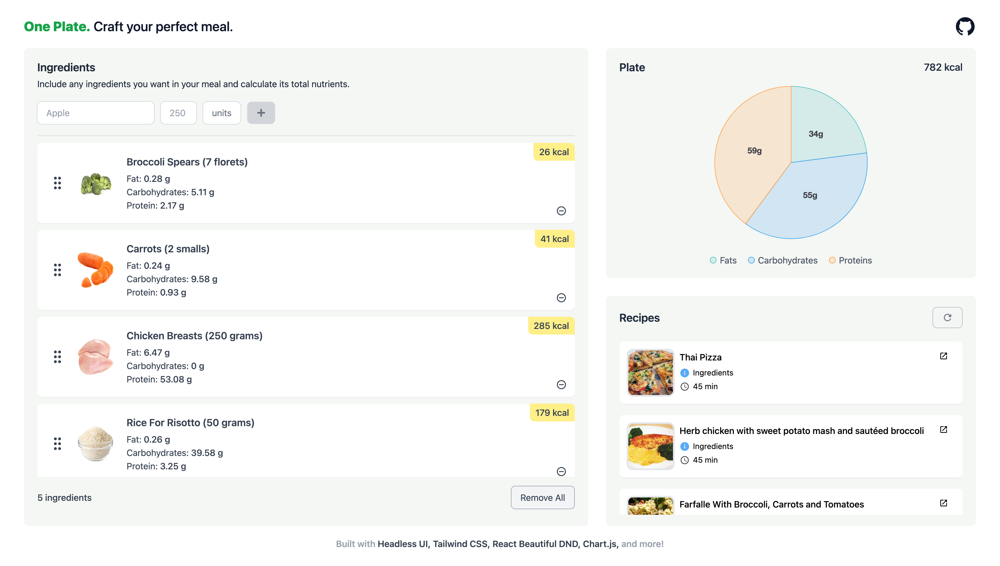

# One Plate

Search for the ingredients you'll include in your meal and find out their total nutrients.

## Table of Contents

- [Motivation](#motivation)
- [Solution](#solution)
- [Features](#features)
- [How does it work?](#how-does-it-work)
- [Demo](#demo)
- [Technologies](#technologies)
- [Lessons learned](#lessons-learned)
- [Feedback](#feedback)

## Motivation

When II first went to the gym I remember feeling confused about the diet process, "you need to ingest this amount of protein, this amount of calories", etc. I wondered, how do I do it, do I need to learn the nutritional value of every meal available out there? Besides, some of the recipes I found on the Internet to meet the required nutritional intake per day, contained ingredients that were difficult, if not impossible, to find locally.

## Solution

I came up with an application where you can search for any ingredient you want to make your food with and as you add these ingredients to your list you will see the total nutritional value from your dish.

Note: For this application I only considered 4 main nutrients to show for the sake of simplicity, these are the nutrients that I think people usually consider the most: proteins, fats, carbohydrates and calories.

## Features

- Search and get the nutritional value of a wide variety of ingredients.
- Add/remove ingredients from your list.
- See the total nutritional value of your list displayed in a pie chart.
- Get recipe recommendations based on your ingredients.

## How does it work?

1. First you need to enter the name of the ingredient in the search bar, let's say "egg".
2. You'll instantly get several ingredient results related to that keyword, such as "egg yolk, egg whites, hard boiled eggs", etc. Select the one you are actually going to consume to be more accurate in the nutritional value you will get.
3. Once you have selected the ingredient, the application will fetch the correct amount units for it (e.g. grams for solids or liters for liquids).
4. Now that you have the ingredient selected and the amount units available for it, all that remains is to enter the exact quantity you are going to consume along with the unit selected.
5. Once these three fields are filled in, the application will allow you to insert the ingredient in your list and you will be able to see the nutritional values you get from that ingredient, you'll also be able to see the total nutritional value of all the ingredients added in a pie chart that will change as you add/remove ingredients from your list.
6. Once you have added all the ingredients that will go into your dish, you can get recipe recommendations based on those ingredients by clicking on the "Get Recipes" button.

## Demo

Here is the link to the working app: https://one-plate.vercel.app/

## Technologies

- [Next.js](https://nextjs.org) - A React framework that gives you building blocks to create web applications.
- [React Hook Form](https://react-hook-form.com) - Performant, flexible and extensible forms with easy-to-use validation.
- [Chart.js](https://www.chartjs.org/) - Simple yet flexible JavaScript charting for designers & developers.
- [React Beautiful DND](https://github.com/atlassian/react-beautiful-dnd) - Beautiful and accessible drag and drop for lists with React.
- [Zustand](https://github.com/pmndrs/zustand) - A small, fast and scalable state-management solution.
- [Tailwind CSS](https://tailwindcss.com/) - A CSS Framework based on utility classes like `flex`, `pt-4`, `text-center`, and many more.
- [Headless UI](https://headlessui.com/) - Unstyled and accessible UI Components designed to integrate with Tailwind CSS.

## Lessons Learned

- Although I found a solution on the fly for my need for generic components (e.g. dropdown, popover) that I didn't want to recreate because it felt like reinventing the wheel; I understood that choosing the right component library for your project could save you tons of time that you could spend on doing other things, so I started exploring solutions like MUI and Chakra UI for my next project.
- I found the code I was writing to manage fetching and server state to be somewhat cumbersome. Manually declaring things like `setIsLoading(true)` and `setIsLoading(false)` didn't feel natural to me, and I needed a better way to handle errors. I heard that React Query solves these problems, so I decided to research it for my next project.
- In overall, with this project I learned that you need to pick the right technologies for the right problems, for example, if you're not going to use SSR or you don't need SEO optimization you're better off using a tool like Vite instead of Next.js to bootstrap your project, as the latter will require you to do some extra configuration when working with certain libraries and to come up with workarounds for certain problems.

## Feedback

If you wish to provide any feedback or just to have a little chat you can contact me through the following email: joangavelan@gmail.com.
